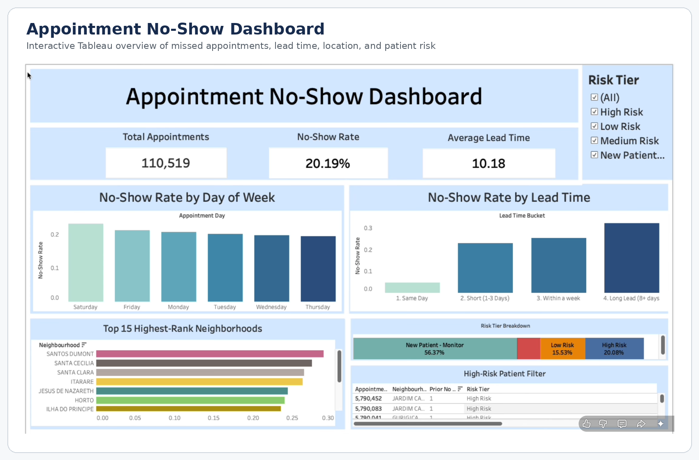
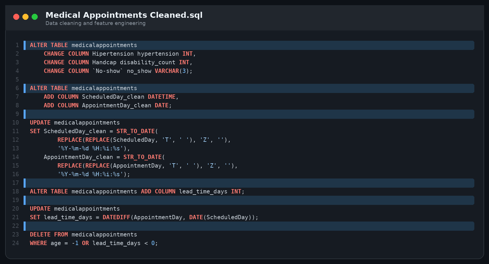
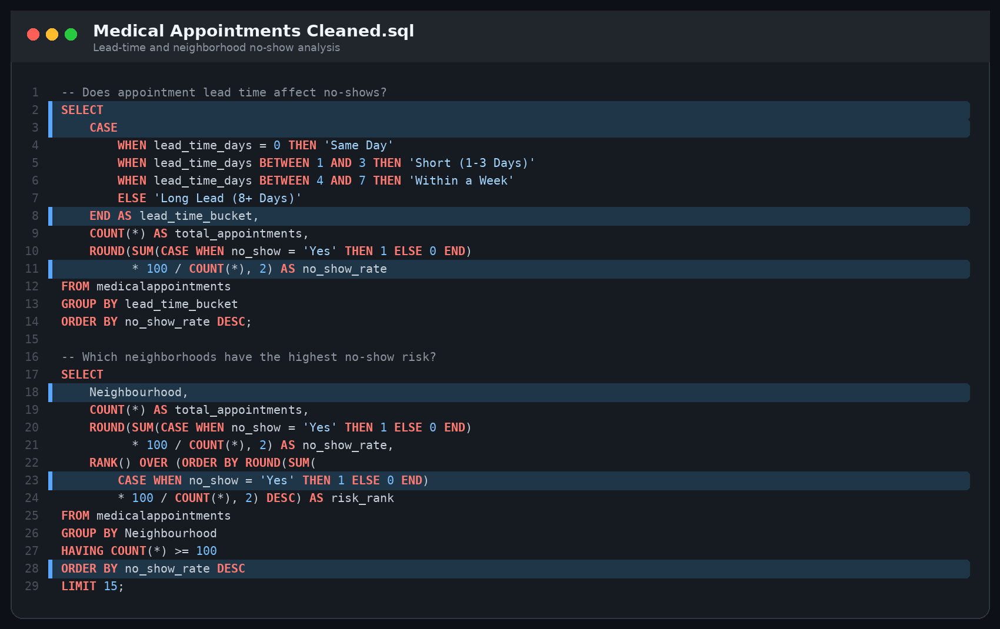
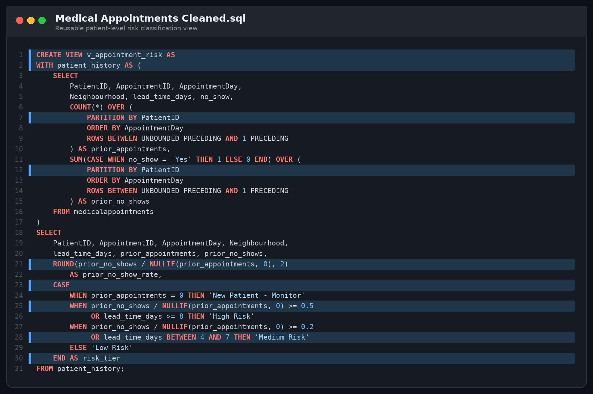

<h1>Medical Appointment No-Show Analysis (MySQL & Tableau)</h1>

<h2>Description</h2>

Objective: Clean and analyze a medical appointment dataset using MySQL, then build an interactive Tableau dashboard to identify the factors associated with missed appointments and flag patients who may require additional follow-up.
  

Key Tasks:

<b>Cleaned and standardized field names, date formats, and data types.</b>

<b>Removed invalid age values and appointments with negative lead times.</b>

<b>Created a lead-time feature measuring the number of days between scheduling and the appointment.</b>

<b>Analyzed no-show behavior by day of the week, booking lead time, age group, SMS status, and neighborhood.</b>

<b>Used window functions and a Common Table Expression (CTE) to calculate each patient's prior appointment and no-show history.</b>

<b>Created a reusable SQL view that classifies appointments into New Patient, Low-, Medium-, and High-Risk tiers.</b>

<b>Built an interactive Tableau dashboard with KPI cards, risk-tier filtering, neighborhood rankings, and a high-risk patient table.</b>

<b>Outcome:</b> Created an end-to-end healthcare analytics project that turns raw appointment records into an analysis-ready dataset, identifies practical no-show patterns, and gives healthcare teams a dashboard for prioritizing outreach to higher-risk patients.

<h2>Key Findings</h2>

<b>The dataset contains 110,519 appointments with an overall no-show rate of 20.19%.</b>

<b>Appointments were scheduled an average of 10.18 days in advance.</b>

<b>Long-lead appointments had the highest no-show rate, while same-day appointments had the lowest.</b>

<b>Saturday had the highest no-show rate among the appointment days shown.</b>

<b>The patient-risk model classified 20.08% of appointments as High Risk and 56.37% as New Patient - Monitor.</b>

<b>Neighborhood ranking and patient-level filters make it possible to focus outreach on the locations and appointments with the greatest risk.</b>

<h2>Languages and Utilities Used</h2>

<b>MySQL, MySQL Workbench, Tableau</b>

<b>SQL Window Functions, CTEs, Views, CASE Statements, and Aggregate Functions</b>

<b>Data Cleaning, Feature Engineering, Exploratory Analysis, Risk Segmentation, and Data Visualization</b>

<h2>Environments Used</h2>

<b>Windows 10</b> (22H2)

<h2>Project Files</h2>

<b>Medical Appointments Cleaned.sql:</b> Data cleaning, feature engineering, exploratory analysis, and patient-risk view creation.

<b>Medical Appointments Project.twbx:</b> Packaged Tableau workbook containing the interactive Appointment No-Show Dashboard.

<h2>Program walk-through:</h2>

<b>Tableau Dashboard Overview</b>
 
The dashboard brings the project's main KPIs and risk indicators together in one view. Users can compare no-show rates by appointment day and lead time, review high-risk neighborhoods, inspect the overall risk-tier distribution, and filter the patient-level table.
  

  

<b>Data Cleaning and Feature Engineering</b>
 
The SQL workflow standardizes inconsistent column names, converts raw timestamp strings into usable MySQL date fields, removes invalid records, and creates the lead-time measure used throughout the analysis.
  

  

<b>No-Show Pattern Analysis</b>
 
CASE expressions and aggregate calculations group appointments into meaningful lead-time buckets. A window ranking then identifies the 15 neighborhoods with the highest no-show rates while excluding locations with fewer than 100 appointments.
  

  

<b>Patient Risk Classification</b>
 
A CTE and window functions calculate each patient's appointment history using only earlier visits. The resulting SQL view assigns a practical risk tier based on prior no-show behavior and the current appointment's lead time, creating a reusable source for the Tableau dashboard.
  

<h2>Business Value</h2>

This analysis can support healthcare operations teams by helping them focus reminder calls, SMS campaigns, scheduling interventions, and follow-up resources on appointments with a higher likelihood of being missed. The dashboard also makes it easier to identify whether no-show risk is being driven by scheduling lead time, location, or a patient's prior attendance history.
